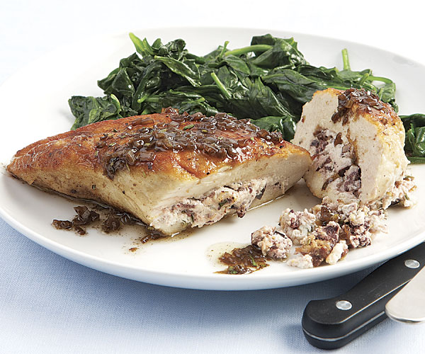

# Goat Cheese Stuffed Chicken Breasts
Chicken breasts stuffed with goat cheese prepared in a balsamic vinegar reduction.

{.recipe-img}

## Ingredients
- 1 teaspoon olive oil (or butter)
- 1 shallot, finely diced
- 1 cup balsamic vinegar
- 2 skinless chicken breast halves
- 2 ounces of goat cheese

## Instructions
1. Preheat oven to 350 degrees F
2. Heat olive oil or butter over medium heat, add shallots until translucent, about 5 min
3. Pour in balsamic vinegar, reduce heat, bring to a simmer. Continue until liquid is reduced by half, about 10 minutes, stirring.
4. Butterfly chicken breasts and spread goat cheese inside. Place in a baking dish.
5. Drizzle 1/3 of the balsamic mixture over the open chicken breasts, close and pour remaining half over the chicken breasts. Optionally secure with toothpicks.
6. Bake in oven until chicken is cooked through, 30 to 35 minutes.
