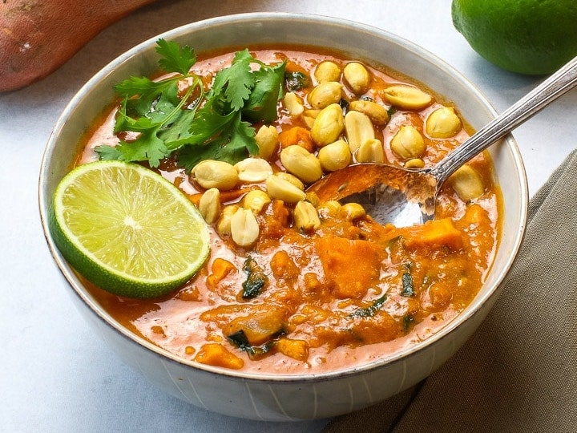

# Groundnut Stew
An African inspired stew made with peanuts. Excellent served over rice with a quarter lime's worth of juice squeezed over the top. You can add chicken for extra protein. Jalapeno works as a substitute for serrano although it does change the flavor somewhat. Add more cayenne or chili pepper to bring up the spice level.

{.recipe-img}

## Ingredients
- 1 tablespoon peanut oil
- 1 medium onion, diced
- 2 garlic cloves, minced
- 1 serrano pepper, diced
- 1 tablespoon ginger, minced
- 1 teaspoon cumin
- 1 teaspoon cayenne
- 1 teaspoon coriander
- 1/2 cup tomato paste
- 2 1/2 cups vegetable stock
- 1 cup coconut milk
- 1/2 cup peanut butter
- 2 cups (or a 15 oz can) chickpeas
- 2 cups (or a 15 oz can) diced tomatoes
- 2 cups (one large) sweet potato diced
- 1 bunch collard greens, loosely chopped
- 1/2 cup peanuts
- 1/2 cup fresh cilantro, chopped
- Sea salt

## Instructions
1. Heat oil in a large pot of medium heat. Add the onion and a pinch of salt. Cook about 15 minutes until onions are golden brown
2. Add garlic, green chili, ginger, cumin, cayenne coriander and tomato paste to the pot and stir everything together. Cook about 3 minutes until the spices mellow some.
3. While the vegetables are cooking, stir together the coconut milk, vegetable stock, and peanut butter. Add the mixture to the pot along with the chickpeas, sweet potato, tomatoes and greens. Turn the heat up to medium high.
4. Bring the stew up to a quick boil and then reduce the heat and let simmer for about 10 minutes. Give it a good stir every so often.
5. Add peanuts and continue to stir for another 10 minutes.
6. The stew is done when the sweet potatoes are tender and the liquid has thickened.
